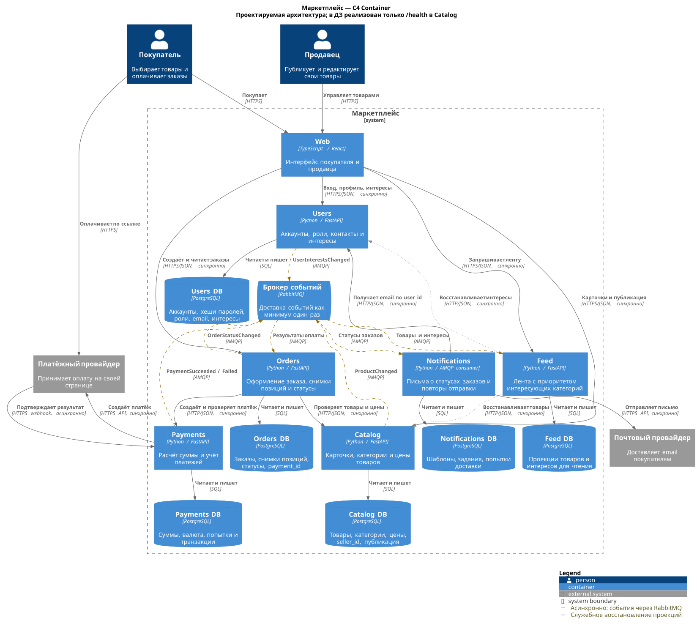

# Маркетплейс

Архитектура маркетплейса и сервис каталога на Python + FastAPI.

## Запуск

Запуск и проверка из корня репозитория:

```sh
docker compose up --build -d --wait
curl -i http://localhost:8080/health
```

`GET /health` возвращает `200 OK` и `{"status":"ok"}`.

Остановка:

```sh
docker compose down
```

## C4 Container



[Открыть SVG крупнее](docs/containers.svg) · [Исходник PlantUML](docs/containers.puml)

## Домены и данные

Каждый домен выделен в отдельный сервис. У каждого своя PostgreSQL с собственными учётными данными;
доступа к чужим таблицам и межсервисных SQL-запросов нет. Ссылки между доменами — обычные ID,
без внешних ключей между БД.

| Домен → сервис | Ответственность | Какие данные ему принадлежат |
| --- | --- | --- |
| Пользователи → **Users** | Регистрация, вход, роли покупателя и продавца, профиль и интересы | Аккаунты, хеши паролей, роли, email, выбранные категории |
| Каталог → **Catalog** | Создание и публикация товаров продавцом, изменение цен; продавец редактирует только свои товары | Карточки, категории, цены, `seller_id`, признак публикации |
| Персональная лента → **Feed** | Подбор и сортировка товаров для покупателя | Проекция опубликованных товаров и копия интересов пользователя для чтения |
| Заказы → **Orders** | Оформление заказа и переходы его статуса | Покупатель, позиции, количество, снимки названий и цен, статус, ссылка на платёж |
| Платежи → **Payments** | Расчёт суммы к оплате, создание платежа у провайдера, учёт его результата | Суммы и валюта, платёжные попытки, ключи идемпотентности, ID и статусы транзакций провайдера |
| Уведомления → **Notifications** | Письма об изменении статуса заказа, повторы при сбоях отправки | Шаблоны, задания на отправку, результат и число попыток доставки |

Web — единый браузерный интерфейс покупателя и продавца, собственных бизнес-данных у него нет.
RabbitMQ хранит сообщения до обработки, но не служит источником истины для заказов или платежей.
Проекции Feed можно восстановить из Catalog и Users через их API; они не дают права менять исходные данные.

Персонализация простая: сначала товары из категорий, выбранных в профиле, внутри группы — новые выше.
Остальные товары идут следом. Для гостя или пользователя без интересов вся лента сортируется по новизне.

## Как сервисы общаются

| Кто → кому | Способ | Зачем |
| --- | --- | --- |
| Web → Users, Catalog, Feed, Orders | Синхронно, HTTPS/JSON | Вход и профиль, работа с товарами, лента, создание и просмотр заказов |
| Orders → Catalog | Синхронно, HTTP/JSON | Проверить публикацию товаров и получить актуальные названия и цены |
| Orders → Payments | Синхронно, HTTP/JSON | Передать сохранённые позиции заказа, получить сумму, ID платежа и ссылку на оплату; уточнить состояние после таймаута |
| Payments ↔ платёжный провайдер | HTTPS API и входящий webhook | Создать платёж и получить подтверждение результата; покупатель платит на странице провайдера |
| Catalog, Users → RabbitMQ → Feed | Асинхронно, AMQP | `ProductChanged`, `UserInterestsChanged`: обновить проекции ленты, в том числе убрать снятый с публикации товар |
| Payments → RabbitMQ → Orders | Асинхронно, AMQP | `PaymentSucceeded`, `PaymentFailed`: обновить статус заказа |
| Orders → RabbitMQ → Notifications | Асинхронно, AMQP | `OrderStatusChanged`: поставить письмо в очередь |
| Notifications → Users | Синхронно, HTTP/JSON | Получить email получателя по `user_id` |
| Notifications → почтовый провайдер | Синхронно, HTTPS API | Отправить письмо и сохранить результат попытки |
| Feed → Catalog, Users | Синхронно, HTTP/JSON, служебные API | Первоначально заполнить или восстановить проекции |

Users выдаёт подписанный токен с ID и ролями. Сервисы проверяют подпись и права локально;
защита внутренних API и доставка ключей относятся к настройке окружения. Цены из браузера не принимаются:
Orders получает их у Catalog и сохраняет снимок, который уже не меняется вслед за карточкой товара.
Payments считает сумму по этому снимку: количество × цена по каждой позиции, затем сумма позиций.
Деньги хранятся в целых копейках, валюта в этой модели одна — RUB. Платёжные реквизиты остаются у провайдера.

Создание заказа и оплата не являются общей транзакцией. Сначала Orders сохраняет заказ в `awaiting_payment`,
затем обращается к Payments с ключом идемпотентности на основе ID заказа. При таймауте запрос можно повторить
с тем же ключом. Только подтверждённый результат оплаты переводит заказ в `paid` или `payment_failed`;
возврат пользователя со страницы провайдера сам по себе ничего не подтверждает.

Событие записывается в outbox в одной транзакции с изменением данных сервиса, затем отправляется в RabbitMQ.
Доставка — как минимум один раз: потребители запоминают `event_id`, а версии сущностей защищают
от применения устаревшего события. Неудачные обработки повторяются, после лимита уходят в отдельную очередь
для разбора.

Лента может обновиться с задержкой, поэтому при оформлении цены проверяются заново. Сбой почты
не отменяет оплаченный заказ: письмо остаётся в очереди. Если Payments или его провайдер недоступны,
заказ ждёт оплаты; ошибки связи не считаются отказом в платеже.

## Варианты и выбор

| Вариант | Плюсы | Минусы и цена выбора |
| --- | --- | --- |
| **Модульный монолит**: один backend, шесть модулей, одна принадлежащая ему БД с разделением по схемам | Один деплой; заказ и внутренние записи платежа можно менять одной транзакцией; проще отладка | Лента, каталог и оформление масштабируются вместе. Изменение отправки писем требует релиза всего backend; сбой процесса затрагивает все домены |
| **Шесть сервисов**: по одному на домен, отдельные БД, HTTP и события | Ленту можно масштабировать отдельно от оформления; интеграции с оплатой и почтой изолированы; у каждого набора данных один владелец | Шесть приложений и БД плюс брокер; нужны идемпотентность, повторы, наблюдение за очередями. Нет общей транзакции заказа и платежа, проекции отстают |

Выбран **второй вариант**. У ленты и каталога разные задачи: первая готовит выдачу для чтения,
второй принимает изменения продавцов. Платежи зависят от внешнего провайдера и имеют собственный учёт,
а отправка писем не должна задерживать заказ.
Профили, роли и интересы остаются вместе в Users, поскольку работают с одним аккаунтом.

За независимость сервисов приходится платить более сложной эксплуатацией и согласованием данных.
Для небольшой команды с коротким сроком запуска модульный монолит был бы проще.
